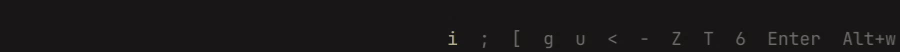
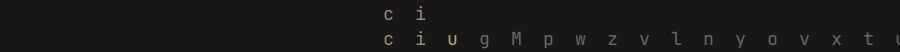
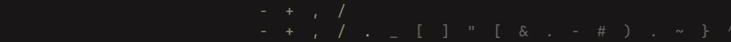
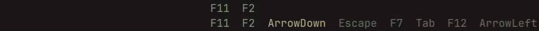
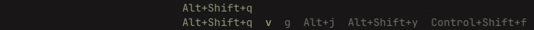
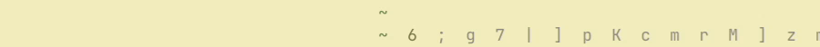

# combo-typing-trainer

Typing trainer that also covers keys (not just characters), shortcuts and key combinations.
It is just a stream of gibberish that, besides regular characters, can contain any key on the keyboard, as well as
combinations with modifiers (Ctrl, Alt, Shift, Meta).

Inspired by [Programmer's Typing Practice by climech](https://climech.github.io/typing-practice/).

# Installation

Download the binary from [the latest release](../../releases/latest).

### OR build from source

Clone the repo and `go build .` (you would need Go and
[ebiten dependencies](https://ebitengine.org/en/documents/install.html)
installed).

# Configuration

Every time you run the binary it looks for `config.toml` in the same directory as the binary.
If absent, it will create a new, [default one](assets/default-config.toml).
Use it as a starting point, it is self-explanatory.
To apply changes, restart the program.

In the `config.toml`, you can set:

### Probability weights

The primary thing you would configure. It is responsible for the chance with which certain categories of chars and keys
appear.
For example:

Just the letters:

Just the symbols:

Just a selected set of keys:

Modifier heavy with just letters:

**Or any combination of just the parts you want with any probabilities you might want.**

### Layouts and custom categories

You can define your own layouts, for example for different languages, or alternatives like Dvorak or Colemak.

Most categories are inferred from the layout (letters, symbols, etc.), but some you can set yourself.
A category is just a set of chars or keys that you can set your own probability weights on.

### Appearance

You can also change all colors and font size.

# License

Licensed under [MIT](LICENSE).

# Note for agents

The project is tiny (less than 2k loc), load the entire thing into your context, no need to pick selectively.
